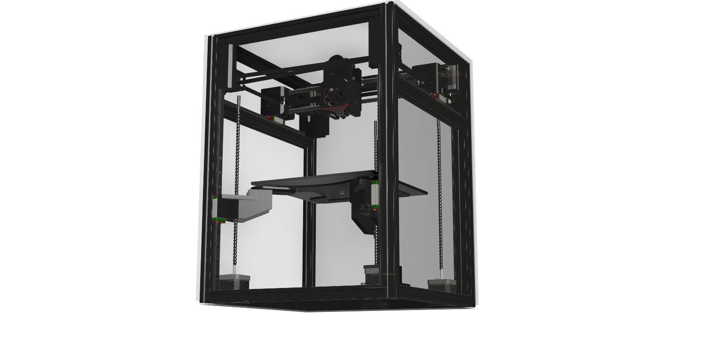
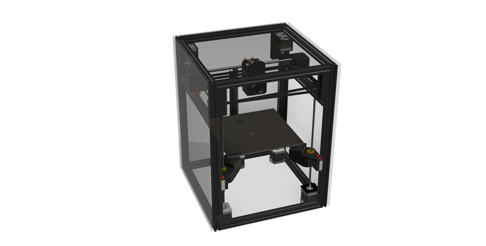
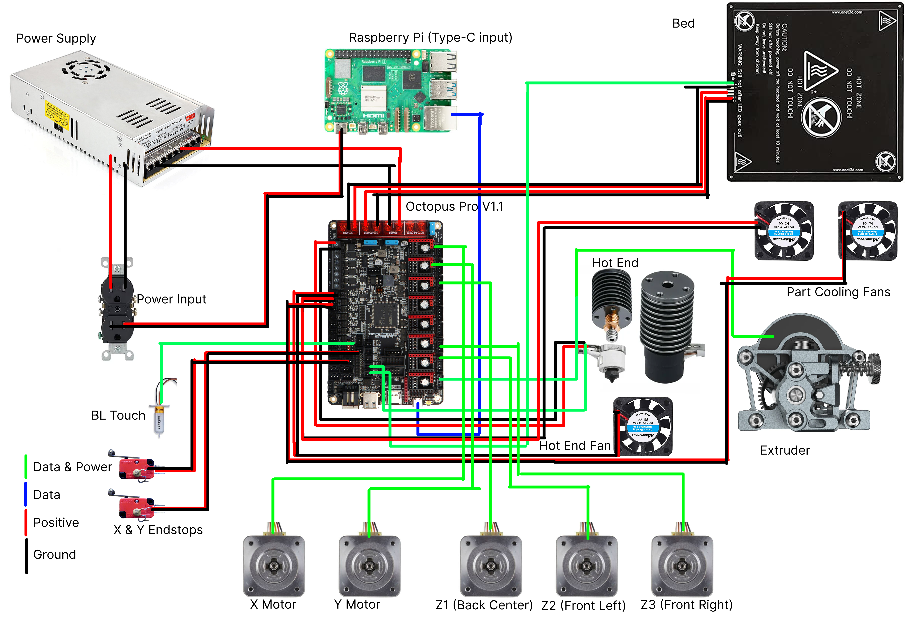

# Hephaestus-2

## Goals:
1. 235x235
2. CoreXY movement system
3. Tension control in the belt 
4. Compact small footprint
5. Enclosed
6. Kinematic Bed (The bed will tilt)

## What is it?
Hephaestus-2 is the second version my custom 3D printer. Hephaestus-2 will be a CoreXY printer with a Kinematic Bed that will be enclosed. That sounds like a lot so let me explain what each of those things mean. 

- What is a 3D Printer?

    A 3D Printer is a machine that uses additive manufacturing to create things. A 3D Printer does this by extruding a material and building it up layer by layer. 3D Printers usually they extrude plastics however there is also some other types of Filaments.

- What is a CoreXY motion system?

    a Core XY motion system is a motion system where the X and Y axis are controlled with two motors that work together to manage the X and Y axes. These systems tend to work well in 3D Printers because they allow for fast precision control of a 3D Printer head.

- What is a Kinematic Bed?

    A Kinematic Bed is a 3D Printer bed that tilts using a three point mounting systems. This allows the bed to tilt. The bed tilting allows for the printer to have better first layers and even allow them to change layer angles.

- What is a enclosed 3D Printer?

## Why did I make it?
I want to learn engineering and I was very interested in 3D Printing as its a powerful tool to design your own parts. However I had never used one before so I did a lot of research and wanted to build my own. This brought me to the hack club event [Infill](https://infill.hackclub.com/) and I was able to participate and go to [demo it at RMMRF](https://youtu.be/5G_g6yMLbMs?si=Rk1-EXst3To_MMzO). Recently I wanted to add many improvements however I became very busy so I had to wait a year to resume progress. 

## Should you build your own?
Right now I would not recommend you build your own as currently the firmware is not setup and there will inevitably problems that have to be fixed when I build it. Also I won't be able to release a full build guide until I build it myself so you would be on your own. Everything I say will just be a estimate about the best ways to build it. 

## Wiring Diagram

## BOM: 
Unfinished however this is what I have so far

## Building tips
1. To start to build the printer I would recommend assembling the frame first as this is where everything else gets mounted.
2. Next you should put together the head and put setup the belt system.
3. Add the bed and bed movement systems.

More detail when I build it.